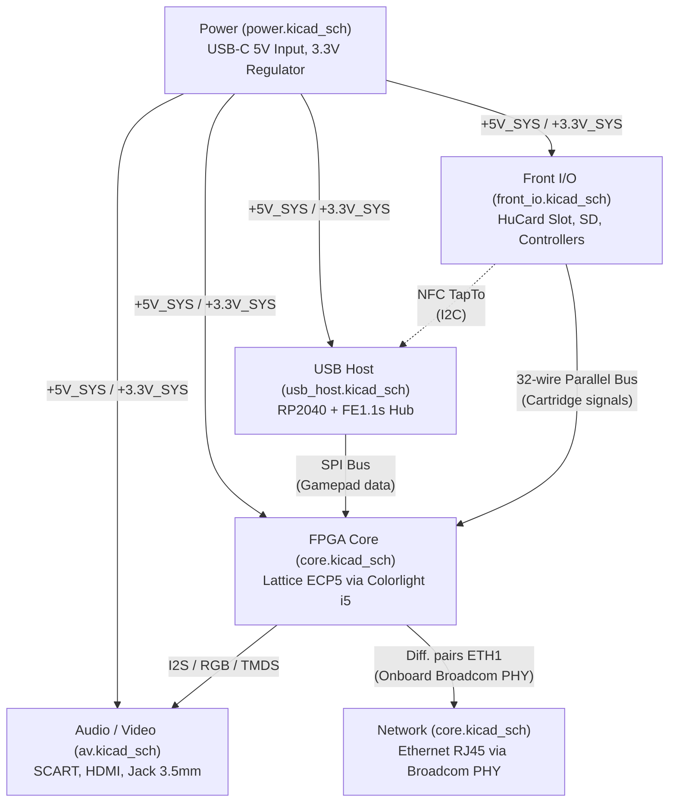
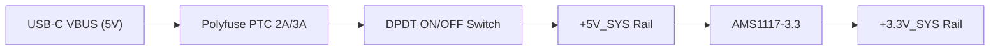
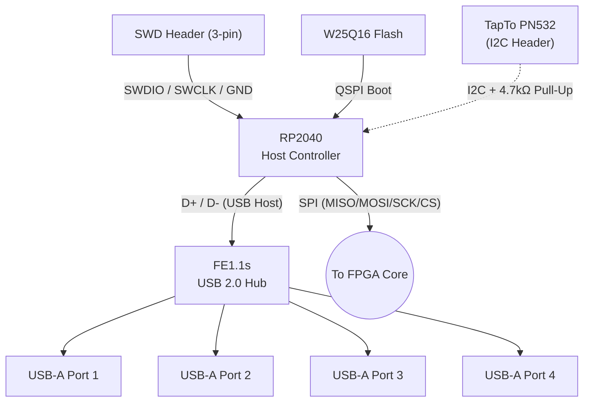
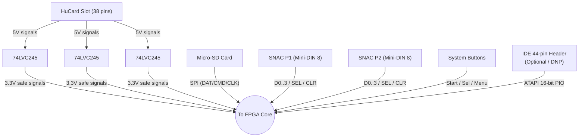
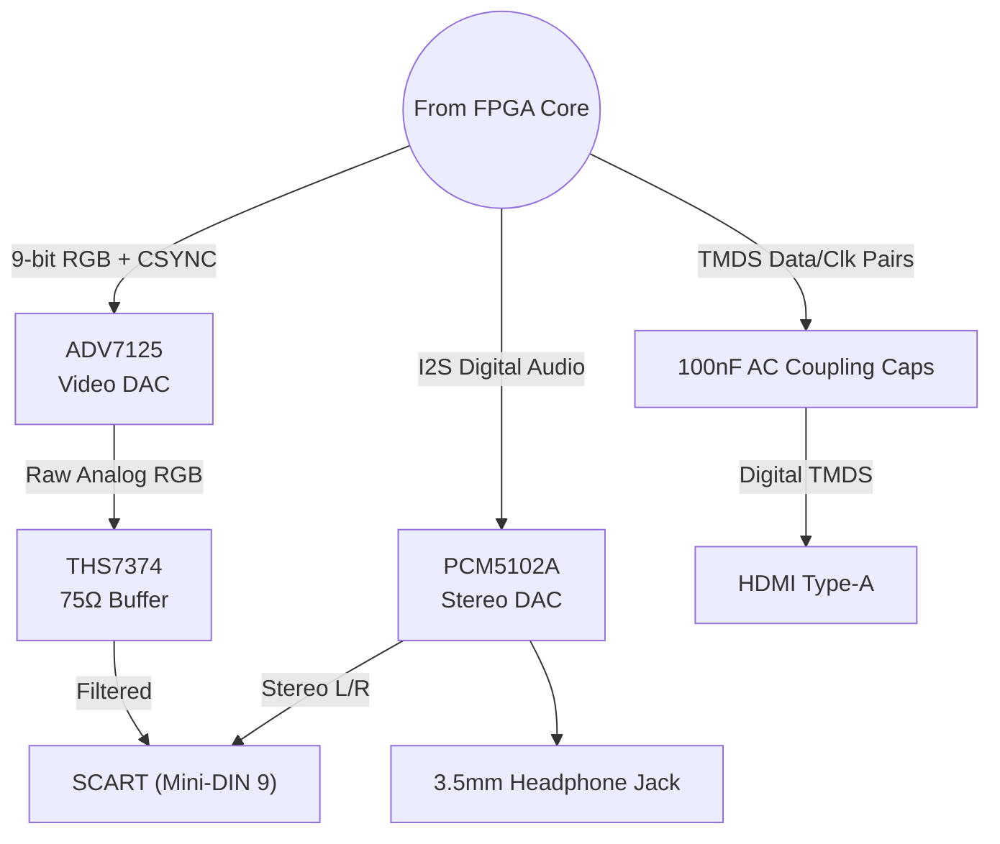
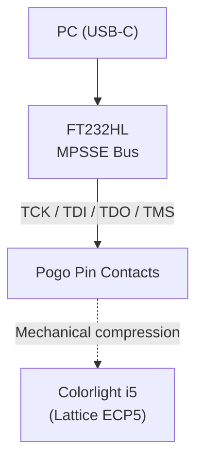
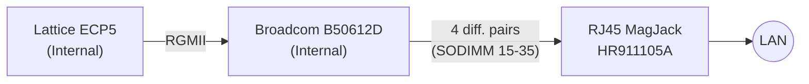

# PCE Colorlight Carrier — FPGA PC Engine on Colorlight i5

> A dedicated hardware carrier board for running a cycle-accurate **PC Engine / TurboGrafx-16** core on a **Colorlight i5** (Lattice ECP5) FPGA module. Designed in KiCad. Inspired by the MiSTer FPGA ecosystem, built as a standalone console.

---

## Table of Contents

- [Overview](#overview)
- [Architecture](#architecture)
- [Features](#features)
- [Feasibility Summary](#feasibility-summary)
- [Bill of Materials (BOM)](#bill-of-materials-bom)
- [FPGA Pin Budget](#fpga-pin-budget)
- [Block-by-Block Topology](#block-by-block-topology)
  - [Power](#a-power)
  - [USB Host (RP2040)](#b-usb-host-rp2040)
  - [Front I/O](#c-front-io)
  - [Audio / Video](#d-audio--video)
  - [FPGA Core & JTAG](#e-fpga-core--jtag)
  - [Ethernet (RJ45)](#f-ethernet-rj45)
- [PCB Specifications](#pcb-specifications)
  - [4-Layer Stackup](#4-layer-stackup)
  - [Design Rules (DRC)](#design-rules-drc)
  - [Routing Guidelines](#routing-guidelines)
- [Pin Mapping Reference](#pin-mapping-reference)
- [Optional: IDE/ATAPI CD-ROM Header](#optional-ideatapi-cd-rom-header)
- [Software Roadmap](#software-roadmap)
- [License](#license)

---

## Overview

This project is a **custom carrier board** that turns a cheap Colorlight i5 LED controller module (~$15) into a fully-featured, standalone retro gaming console for the NEC PC Engine / TurboGrafx-16.

**Key design decisions:**
- **Real HuCard cartridge slot** — physical cartridges run with zero latency, no ROM loading required
- **SD card ROM loading** — ROMs and CD-ROM² images can also be loaded from Micro-SD into the onboard 32 MB SDRAM
- **SNAC controller ports** — direct FPGA-to-controller connection for lag-free input (no USB polling)
- **Modern USB controllers** — RP2040 MCU handles USB gamepads via a dedicated hub, communicating with the FPGA over SPI
- **Analog + Digital video** — simultaneous SCART RGB (via DAC) and HDMI (passive TMDS)
- **NFC game loading** — TapTo-compatible PN532 module for tap-to-play functionality
- **Ethernet** — onboard Broadcom PHY exposed via RJ45 for network ROM loading, netplay, and remote updates
- **Optional physical CD-ROM** — IDE/ATAPI header for a slim laptop CD drive (Do Not Populate by default)

---

## Architecture

The KiCad project is organized into **5 hierarchical sub-sheets** that communicate through well-defined buses:



---

## Features

| Feature | Implementation | Details |
|:---|:---|:---|
| **FPGA Module** | Colorlight i5 v7 (SODIMM 200) | Lattice ECP5 LFE5U-25F, ~24K LUTs |
| **Onboard Memory** | 2× EtronTech EM636165TS-6G | 32 MB SDRAM (internal to module) |
| **Physical Cartridge** | 38-pin HuCard slot | 8-bit data + 21-bit address + 3 control lines |
| **ROM Storage** | Micro-SD card (SPI) | Load ROMs/CD images into SDRAM |
| **Native Controllers** | 2× Mini-DIN 8 (SNAC) | Direct FPGA connection, zero-latency |
| **USB Controllers** | 4× USB-A via FE1.1s hub | Managed by RP2040, forwarded via SPI |
| **Analog Video** | ADV7125 DAC + THS7374 buffer | 9-bit RGB → SCART (Mini-DIN 9) |
| **Digital Video** | Passive TMDS | HDMI Type-A output |
| **Audio** | PCM5102A I2S DAC | Stereo via SCART + 3.5mm Jack |
| **NFC (TapTo)** | PN532 module (I2C) | Tap a tag → load a game |
| **Ethernet** | Broadcom B50612D PHY (onboard) | RJ45 MagJack — network loading, netplay |
| **CD-ROM (Optional)** | IDE/ATAPI 44-pin header (DNP) | Slim laptop CD drive for PC Engine CD-ROM² |
| **JTAG Programming** | FT232HL + Pogo Pins | Flash ECP5 bitstream via openFPGALoader |
| **RP2040 Programming** | SWD 3-pin header + BOOTSEL | Flash firmware via Picoprobe / ST-Link |
| **Debug** | UART 3-pin header | TX/RX from FPGA to USB-TTL dongle |
| **Power** | USB-C (5V) | Polyfuse protected, DPDT power switch |

---

## Feasibility Summary

### Pin Budget (Colorlight i5 SODIMM 200)

The SODIMM 200 connector has 200 pins total. After deductions:
- **24 pins** — Power / GND
- **54 pins** — Not Connected (NC)
- **22 pins** — Reserved for Ethernet PHY (dedicated, not GPIO)
- **= 106 usable GPIOs**

| Subsystem | Interface | FPGA Pins Used |
|:---|:---|:---:|
| HuCard Cartridge Slot | Parallel (8 Data + 21 Addr + 3 Ctrl) | **32** |
| SNAC Controller Ports (×2) | Direct digital I/O | **12** |
| Analog Video (SCART) | 9-bit RGB + CSYNC | **10** |
| Digital Video (HDMI) | TMDS (4 differential pairs) | **8** |
| USB Host Bridge (RP2040) | SPI Slave | **4** |
| Micro-SD Card Reader | SPI | **4** |
| Audio (I2S DAC) | I2S (no MCLK) | **3** |
| System Buttons + UART | 3 buttons + 2 debug | **5** |
| IDE/ATAPI Header (Optional) | 16-bit PIO bus | **25** |
| | | |
| **Total (with IDE)** | | **103 / 106 (97%)** |
| **Total (without IDE)** | | **78 / 106 (73%)** |

**Spare GPIOs:** 3 pins remaining with IDE option (SODIMM pins 110/E17, 112/D18, 114/D17), or 28 pins without IDE.

### Logic Budget (Lattice ECP5 LFE5U-25F)

| Resource | Available | Estimated Usage | Margin |
|:---|:---:|:---:|:---:|
| **LUTs** | 24,000 | ~9,000–13,200 (core + ATAPI) | **45–63%** |
| **BRAM** | ~1 Mbit | PC Engine needs 8 KB Work + 64 KB VRAM | Ample |
| **SDRAM** | 32 MB (onboard) | Largest HuCard = 1 MB; CD-ROM² by sectors | Ample |

> The ECP5 is significantly oversized for a PC Engine core — excellent for performance and future extensions.

---

## Bill of Materials (BOM)

| Sub-Sheet | KiCad Symbol | Role | Qty | LCSC Ref |
|:---|:---|:---|:---:|:---|
| **FPGA_Core** | `Colorlight:Colorlight_i5_v7` | SODIMM 200 socket for i5 module | 1 | C13744 |
| | `Interface_USB:FT232HL` | USB → MPSSE (JTAG) bridge | 1 | C84151 |
| | `Connector_Generic:Conn_01x04` | Pogo Pin contacts (JTAG test pads) | 1 | Mill-Max / Ali |
| | `Memory_EEPROM:93LC46B-xSN` | FT232HL identification EEPROM | 1 | C130424 |
| | `Device:Crystal` | 12 MHz SMD crystal (3225) for FT232HL | 1 | C9002 |
| | `Connector_Generic:Conn_01x03` | UART debug pin header (TX/RX/GND) | 1 | THT header |
| | `Connector:RJ45_Shielded_MagJack` | Ethernet RJ45 with integrated magnetics | 1 | C386755 |
| **Power** | `Connector:USB_C_Receptacle_USB2.0` | 5V power input | 1 | C165948 |
| | `Device:Polyfuse` | Resettable PTC fuse (2A/3A) | 1 | C373379 |
| | `Switch:SW_DPDT_x2` | Main ON/OFF power switch | 1 | THT mech. |
| | `Regulator_Linear:AMS1117-3.3` | 3.3V LDO regulator | 1 | C6186 |
| | Misc `Device:R` / `Device:C` | 5.1kΩ resistors, decoupling caps | X | C23186 / C19702 |
| **Audio_Video** | `Video:ADV7125` | RGB Video DAC (24-bit) | 1 | C10141 |
| | `Audio_DAC:PCM5102A` | I2S Stereo Audio DAC | 1 | C43360 |
| | `Video:THS7374` | 75Ω Video buffer / amplifier | 1 | C60074 |
| | `Connector_Mini-DIN:Mini-DIN-9` | SCART output (MegaDrive 2 pinout) | 1 | Custom |
| | `Connector:HDMI_A` | HDMI Type-A output | 1 | C138388 |
| | `Connector_Audio:Jack_3.5mm` | 3.5mm stereo headphone jack | 1 | Custom |
| **Front_IO** | `74xx:74LVC245` | Bus transceivers (5V↔3.3V level shift) | 3 | C9605 |
| | `Connector_Generic:Conn_02x19` | HuCard 38-pin cartridge slot | 1 | Custom |
| | `Connector:MicroSD_Card_SPI` | Micro-SD card reader (SPI) | 1 | C91145 |
| | `Connector_Mini-DIN:Mini-DIN-8` | SNAC controller ports (PC Engine) | 2 | Custom |
| | `Switch:SW_Push` | Tactile push buttons (Menu/Sel/Start/Reset) | 4 | C118365 |
| | `Connector_Generic:Conn_02x22` | IDE 44-pin slim header (optional, DNP) | 1 | THT mech. |
| **USB_Host** | `MCU_RaspberryPi_and_Boards:RP2040` | USB host MCU (bare chip) | 1 | C2842407 |
| | `Interface_USB:FE1.1s` | USB 2.0 hub controller (4-port) | 1 | C13890 |
| | `Memory_Flash:W25Q16` | 16 Mbit QSPI flash (RP2040 boot) | 1 | C82317 |
| | `Device:Crystal` | 12 MHz SMD crystal (3225) for RP2040 | 1 | C9002 |
| | `Connector:USB_A` | USB-A receptacles for gamepads | 4 | C85901 |
| | `Connector_Generic:Conn_01x04` | PN532 NFC module castellation header | 1 | THT holes |

---

## Block-by-Block Topology

### A. Power



- **USB-C Configuration:** 5.1kΩ pull-down resistors on both CC1 and CC2 to GND (power-only, D+/D- floating)
- **Power Distribution:** `+5V_SYS` and `+3.3V_SYS` are exported as hierarchical labels to all other sheets
- **Decoupling:** 10µF + 100nF between AMS1117 VOUT and GND

### B. USB Host (RP2040)



- **Hub Wiring:** 4 USB-A ports wired in star topology to FE1.1s downstream ports
- **RP2040 USB:** Native USB D+/D- connected to FE1.1s upstream port (host mode)
- **CRITICAL — SWD Header:** 3-pin header (SWDIO, SWCLK, GND) is mandatory for initial firmware flashing
- **BOOTSEL Button:** Tied to QSPI_SS — pull to GND to enter USB bootloader mode
- **TapTo NFC:** PN532 connected via I2C on RP2040 GPIO4 (SDA) / GPIO5 (SCL), powered from +3.3V_SYS
- **FPGA Bridge:** SPI output to ECP5 pins C2 (MISO), B1 (MOSI), C1 (SCK), D2 (CS)

### C. Front I/O



- **HuCard Slot (38 pins):** Never connected directly to FPGA — all 32 signals pass through 3× 74LVC245 level shifters (5V ↔ 3.3V protection). FPGA pins 41→84 (contiguous block)
- **SNAC Controllers:** D0–D3 = controller → FPGA (input), SEL/CLR = FPGA → controller (output). 10kΩ pull-ups on data lines
- **Micro-SD:** SPI mode with 10kΩ pull-ups on data lines. FPGA pins: F18/G16/E18/F17
- **IDE/ATAPI (Optional):** 44-pin slim IDE header for physical CD-ROM drive. 25 GPIOs, DNP by default. See [dedicated section](#optional-ideatapi-cd-rom-header)

### D. Audio / Video



- **Video DAC (ADV7125):** 560Ω (1%) resistor on RSET pin. Outputs → THS7374 buffer → SCART
- **Audio DAC (PCM5102A):** SCK (pin 11) tied to GND (enables internal PLL). FMT (pin 16) tied to GND (I2S standard)
- **HDMI (Passive TMDS):** 100nF ceramic capacitor in series on each of the 8 TMDS data lines (AC coupling). FPGA pins 95→113 (contiguous differential pairs)
- **SCART Pinout (MegaDrive 2 / Mini-DIN 9):** Pin 1 = CSYNC, Pin 2 = +5V (via 470Ω), Pins 3/4 = L/R Audio, Pin 6 = Blue, Pin 7 = Green, Pin 8 = Red

### E. FPGA Core & JTAG



- **JTAG via Pogo Pins:** The Colorlight i5 does not expose JTAG through the SODIMM connector. 4 pogo pins make contact with test pads underneath the module:
  - Test Pad J27 → TCK (ADBUS0)
  - Test Pad J32 → TDI (ADBUS1)
  - Test Pad J30 → TDO (ADBUS2)
  - Test Pad J31 → TMS (ADBUS3)
- **FT232HL:** 12 MHz crystal on OSCI/OSCO (22pF load caps). EEPROM 93C46 for device identification (optional but recommended)
- **Debug UART:** FPGA pins 116 (G5) = TX, 118 (D16) = RX → 3-pin header for USB-TTL dongle

### F. Ethernet (RJ45)

The Colorlight i5 includes an onboard **Broadcom B50612D** Ethernet PHY connected internally to the ECP5 via RGMII. The differential pairs are exposed on SODIMM pins 15→35 (ETH1). **No FPGA GPIO is consumed.**



| Pair | SODIMM Pins | Signal | RJ45 Pin (T568B) |
|:---:|:---:|:---|:---:|
| 1+/1- | 15 / 17 | ETH1_1P / ETH1_1N | 1 / 2 (TX) |
| 2+/2- | 23 / 21 | ETH1_2P / ETH1_2N | 3 / 6 (RX) |
| 3+/3- | 27 / 29 | ETH1_3P / ETH1_3N | 4 / 5 |
| 4+/4- | 35 / 33 | ETH1_4P / ETH1_4N | 7 / 8 |

- **Termination:** 49.9Ω (1%) series resistors on each TX line
- **Connector:** RJ45 with integrated magnetics (Hanrun HR911105A, LCSC C386755)
- **Use Cases:** Network ROM/ISO loading, remote core updates, low-latency netplay, CD-ROM² image streaming

> A second Ethernet port (ETH2, SODIMM pins 16→36) is available but unused in this design.

---

## PCB Specifications

### 4-Layer Stackup

```
┌────────────────────────────────────────────────────┐
│  TOP (L1)     — Components + Primary signal routing │
│                 (HDMI, USB, Ethernet diff. pairs)   │
├────────────────────────────────────────────────────┤
│  INNER 1 (L2) — Solid GND plane                    │
│                 (Impedance reference — CRITICAL)    │
├────────────────────────────────────────────────────┤
│  INNER 2 (L3) — Power planes                       │
│                 (Split: +5V_SYS / +3.3V_SYS)       │
├────────────────────────────────────────────────────┤
│  BOTTOM (L4)  — SMD components + Secondary routing  │
│                 (Parallel buses: HuCard, IDE, SNAC) │
└────────────────────────────────────────────────────┘
```

- **Total thickness:** 1.6 mm
- **Dielectric:** Standard FR4 (Er ≈ 4.5)
- **Compatible with:** JLCPCB 4-layer Economic option (~$8–15 for 5 pcs)

> **CRITICAL:** The GND plane on L2 must never be broken underneath HDMI, USB, or Ethernet differential pairs.

### Design Rules (DRC)

| Parameter | Value | Notes |
|:---|:---|:---|
| Standard trace width | 0.2 mm (8 mil) | General logic signals |
| Power trace width | 0.4–0.5 mm (16–20 mil) | +5V / +3.3V rails |
| Minimum clearance | 0.2 mm (8 mil) | Trace-to-trace spacing |
| HDMI / Ethernet diff. pairs | 0.18 mm width, 0.15 mm gap | Target ~100Ω differential |
| USB 2.0 diff. pairs | 0.20 mm width, 0.15 mm gap | Target ~90Ω differential |
| Via drill | 0.3 mm | JLCPCB standard |
| Via annular ring | 0.15 mm min | JLCPCB minimum |
| Via-to-track clearance | 0.2 mm | Prevents parasitic coupling |
| Pogo Pin placement | ±0.1 mm tolerance | Critical alignment with Colorlight test pads |

### Routing Guidelines

- **Differential pairs** (HDMI, USB, Ethernet): Route on TOP layer (L1) above the solid GND plane (L2). Maintain P/N length symmetry (±0.5 mm max skew)
- **Parallel buses** (HuCard, IDE): Route on BOTTOM layer (L4). No impedance constraint, but keep trace lengths similar within each group
- **Decoupling:** Place 100nF caps as close as possible to each IC power pin. The L2 GND plane provides the natural return current path
- **Copper fills:** Fill empty areas on TOP and BOTTOM with GND pour for EMI shielding and thermal dissipation
- **Isolation:** Maintain ≥0.5 mm spacing between Ethernet, HDMI, and USB differential pairs

---

## Pin Mapping Reference

### Controller Ports (SNAC — Mini-DIN 8)

| Signal | Player 1 (SODIMM Pin / Ball) | Player 2 (SODIMM Pin / Ball) | Direction |
|:---|:---|:---|:---:|
| SEL | 129 / D3 | 130 / F1 | FPGA → Controller |
| CLR | 131 / C4 | 132 / F3 | FPGA → Controller |
| D0 | 133 / B4 | 134 / G3 | Controller → FPGA |
| D1 | 135 / C3 | 136 / H3 | Controller → FPGA |
| D2 | 137 / E3 | 138 / H4 | Controller → FPGA |
| D3 | 139 / A3 | 140 / H5 | Controller → FPGA |

### Micro-SD Card (SPI)

| Signal | SODIMM Pin | ECP5 Ball |
|:---|:---:|:---:|
| MISO (DAT0) | 94 | F18 |
| MOSI (CMD) | 96 | G16 |
| SCK (CLK) | 98 | E18 |
| CS (DAT3) | 100 | F17 |

### RP2040 SPI Bridge

| Signal | SODIMM Pin | ECP5 Ball |
|:---|:---:|:---:|
| SPI MISO | 141 | C2 |
| SPI MOSI | 143 | B1 |
| SPI SCK | 145 | C1 |
| SPI CS | 147 | D2 |

### I2S Audio (PCM5102A)

| Signal | SODIMM Pin | ECP5 Ball |
|:---|:---:|:---:|
| BCK (Bit Clock) | 81 | L20 |
| DIN (Data) | 83 | L18 |
| LRCK (Word Select) | 85 | K20 |

### RGB Video (ADV7125)

| Signal | SODIMM Pins | ECP5 Balls |
|:---|:---|:---|
| RED (3 bits) | 73, 75, 77 | P18, N17, N18 |
| GREEN (3 bits) | 87, 89, 91 | K19, J20, J19 |
| BLUE (3 bits) | 93, 86, 88 | H20, H18, H17 |
| CSYNC | 79 | M18 |

### HDMI (TMDS Differential Pairs)

| Signal | SODIMM Pins | ECP5 Balls |
|:---|:---:|:---:|
| D0+ / D0- | 95 / 97 | G20 / G19 |
| D1+ / D1- | 99 / 101 | F20 / F19 |
| D2+ / D2- | 103 / 109 | E20 / E19 |
| CLK+ / CLK- | 111 / 113 | D20 / D19 |

### HuCard Cartridge Slot (via 74LVC245 Level Shifters)

**Data Bus (Bidirectional):**

| Signal | SODIMM Pin | ECP5 Ball |
|:---|:---:|:---:|
| D0–D7 | 41, 42, 44, 46, 48, 49, 50, 51 | U16, R1, T1, U1, Y2, K18, W1, C18 |

**Address Bus (FPGA Output):**

| Signal | SODIMM Pins | ECP5 Balls |
|:---|:---|:---|
| A0–A3 | 52, 54, 57, 58 | V1, M1, T18, N2 |
| A4–A7 | 59, 60, 61, 62 | R18, N3, R17, T2 |
| A8–A11 | 63, 64, 65, 66 | P17, M3, M17, T3 |
| A12–A15 | 67, 68, 69, 70 | T17, R3, U18, N4 |
| A16–A19 | 71, 72, 74, 76 | U17, M4, L4, L5 |
| A20 | 78 | P16 |

**Control Signals:**

| Signal | SODIMM Pin | ECP5 Ball |
|:---|:---:|:---:|
| ~CE (Card Enable) | 80 | J16 |
| ~OE (Read Enable) | 82 | J18 |
| ~WE (Write Enable) | 84 | J17 |

### System Buttons + Debug UART

| Signal | SODIMM Pin | ECP5 Ball |
|:---|:---:|:---:|
| Button 1 (Menu) | 148 | K4 |
| Button 2 (Select) | 150 | K5 |
| Button 3 (Start) | 152 | B3 |
| UART TX (FPGA out) | 116 | G5 |
| UART RX (FPGA in) | 118 | D16 |

---

## Optional: IDE/ATAPI CD-ROM Header

> This connector is **optional (DNP)**. It allows connecting a slim 44-pin IDE laptop CD/DVD drive for playing PC Engine CD-ROM² / Super CD-ROM² games directly from physical disc.

**How it works:** The FPGA drives the CD-ROM in **16-bit PIO mode** via the ATAPI protocol. At 1× CD speed (150 KB/s), the bandwidth is trivial for the ECP5. Sectors are read into the 32 MB onboard SDRAM. The Verilog controller needs ~800–1200 LUTs.

**Physical connector:** `Connector_Generic:Conn_02x22` — 44-pin male header, 2.0mm pitch

### IDE Pin Assignments (25 GPIOs)

| SODIMM Pin | ECP5 Ball | IDE Signal | Direction |
|:---:|:---:|:---|:---:|
| 115 | C20 | DD0 (Data 0) | Bidir |
| 117 | B20 | DD1 (Data 1) | Bidir |
| 119 | B19 | DD2 (Data 2) | Bidir |
| 120 | F5 | DD3 (Data 3) | Bidir |
| 121 | B18 | DD4 (Data 4) | Bidir |
| 122 | E6 | DD5 (Data 5) | Bidir |
| 123 | A19 | DD6 (Data 6) | Bidir |
| 124 | E5 | DD7 (Data 7) | Bidir |
| 125 | C17 | DD8 (Data 8) | Bidir |
| 126 | F4 | DD9 (Data 9) | Bidir |
| 127 | A18 | DD10 (Data 10) | Bidir |
| 128 | E4 | DD11 (Data 11) | Bidir |
| 149 | D1 | DD12 (Data 12) | Bidir |
| 151 | E2 | DD13 (Data 13) | Bidir |
| 153 | E1 | DD14 (Data 14) | Bidir |
| 155 | F2 | DD15 (Data 15) | Bidir |
| 142 | J4 | DA0 (Address 0) | Output |
| 144 | J5 | DA1 (Address 1) | Output |
| 146 | K3 | DA2 (Address 2) | Output |
| 154 | A2 | ~CS0 (Chip Select 0) | Output |
| 156 | B2 | ~CS1 (Chip Select 1) | Output |
| 90 | G18 | ~DIOR (Read Strobe) | Output |
| 92 | H16 | ~DIOW (Write Strobe) | Output |
| 102 | F16 | ~RESET | Output |
| 104 | E16 | INTRQ (Interrupt) | Input |

**Remaining spare GPIOs (3):** Pins 110 (E17), 112 (D18), 114 (D17)

**Passive components:** 10kΩ pull-ups on ~DIOR, ~DIOW, ~CS0, ~CS1, ~RESET to +3.3V. No level shifter needed — slim IDE drives are natively 3.3V compatible.

---

## Software Roadmap

The hardware carrier board is fully specified. The remaining work is pure software/HDL:

1. **Verilog Core Adaptation** — Port an existing PC Engine MiSTer core (e.g., [MiSTer-devel/TurboGrafx16_MiSTer](https://github.com/MiSTer-devel/TurboGrafx16_MiSTer)) to the Lattice ECP5 / Colorlight i5 pin constraints
2. **RP2040 Firmware** — Implement USB HID host stack (TinyUSB) for gamepad reading + SPI bridge to FPGA + I2C driver for PN532 TapTo
3. **SD Card Loader** — Implement FAT32 reading + ROM/ISO loading into SDRAM from Verilog
4. **ATAPI Controller (Optional)** — Verilog state machine for IDE PIO mode CD-ROM reading
5. **Ethernet Stack (Optional)** — LiteEth or similar for network ROM streaming

---

## License

This project is licensed under the **CERN Open Hardware Licence - Strongly Reciprocal v2.0 (CERN-OHL-S v2.0)**. 

- **Hardware:** All KiCad PCB designs, schematics, and BOM are open-source. Any derivative hardware must be shared under the same license.
- **Software/HDL:** While the hardware is CERN-OHL-S, the FPGA cores and RP2040 firmware may be subject to their own respective licenses (typically GPL or BSD). Please check individual sub-folders.

---

**Built with KiCad. Powered by Lattice ECP5. Playing PC Engine.**
